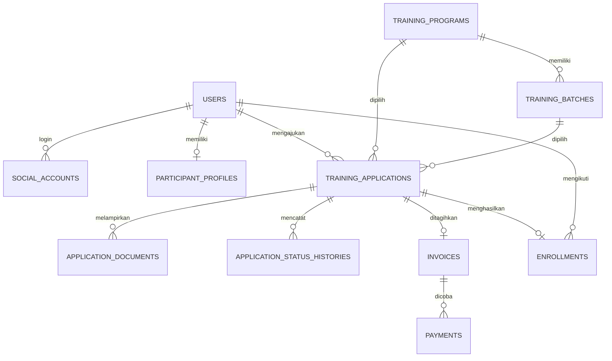

# Struktur Database Alur Pendaftaran Peserta

## Alur utama

1. Pengguna membuat akun atau login menggunakan Google.
2. Pengguna memilih program dan, jika tersedia, batch pelatihan.
3. Pengguna melengkapi profil, mengunggah dokumen, lalu mengirim pendaftaran.
4. Admin memeriksa data dan dokumen.
5. Pendaftaran yang disetujui memperoleh invoice.
6. Pengguna membayar melalui payment gateway.
7. Webhook terverifikasi mengubah invoice menjadi lunas dan membuat enrollment.
8. Dashboard peserta mengambil data dari enrollment aktif.

## Relasi tabel

## Tanggung jawab tabel

| Tabel | Fungsi |
| --- | --- |
| `users` | Akun, role, status, dan waktu login terakhir |
| `social_accounts` | Identitas Google OAuth; akun Gmail tidak menyimpan password lokal |
| `participant_profiles` | Data diri terbaru milik pengguna |
| `training_programs` | Master program pelatihan |
| `training_batches` | Jadwal, periode pendaftaran, dan kapasitas kelas |
| `training_applications` | Pendaftaran serta hasil verifikasi admin |
| `application_documents` | Metadata berkas persyaratan dan hasil pemeriksaannya |
| `application_status_histories` | Audit perubahan status pendaftaran |
| `invoices` | Tagihan resmi setelah pendaftaran disetujui |
| `payments` | Setiap percobaan transaksi pada payment gateway |
| `payment_webhooks` | Payload callback gateway untuk validasi dan idempotensi |
| `enrollments` | Hak akses peserta ke dashboard program/batch |

## Status yang disarankan

- `training_applications`: `draft`, `submitted`, `under_review`, `revision_required`, `approved`, `rejected`, `cancelled`
- `application_documents`: `pending`, `approved`, `rejected`
- `invoices`: `unpaid`, `paid`, `expired`, `cancelled`, `refunded`
- `payments`: `pending`, `paid`, `failed`, `expired`, `cancelled`, `refunded`
- `enrollments`: `active`, `completed`, `cancelled`, `suspended`

## Aturan transaksi penting

- Invoice hanya dibuat untuk pendaftaran berstatus `approved`.
- Status lunas hanya boleh berasal dari webhook yang tanda tangannya valid, bukan dari redirect browser.
- Proses webhook harus memakai `gateway + event_id` sebagai kunci idempotensi.
- Perubahan invoice menjadi `paid` dan pembuatan enrollment harus dilakukan dalam satu transaksi database.
- `personal_data_snapshot` menyimpan salinan data saat formulir dikirim agar hasil verifikasi tetap dapat diaudit walaupun profil pengguna diperbarui.
- File dokumen disimpan di object storage/private storage; database hanya menyimpan metadata dan lokasi file.
- Dashboard peserta hanya dapat dibuka bila tersedia enrollment berstatus `active`.
